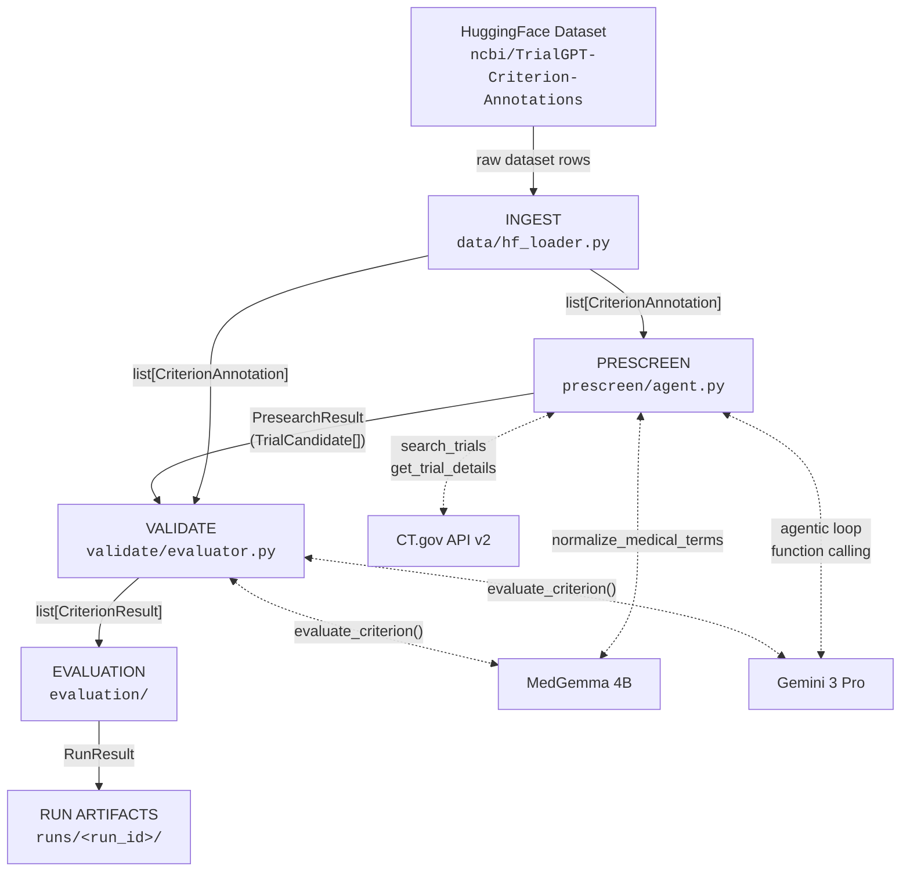

# Pipeline Architecture: Data Contracts & Flow

This document describes the trialmatch pipeline data flow, Pydantic model contracts,
component isolation strategy, and run artifact structure.

---

## High-Level Pipeline Flowchart



---

## Data Contract Summary Table

| Component | Input | Output | Key Model |
|-----------|-------|--------|-----------|
| **INGEST** | HF dataset rows (dict) | `list[CriterionAnnotation]` | `CriterionAnnotation` |
| **PRESCREEN** | patient_note (str), key_facts (dict), adapters | `PresearchResult` | `TrialCandidate`, `ToolCallRecord` |
| **VALIDATE** | patient_note (str), criterion_text (str), criterion_type (str), adapter | `CriterionResult` | `CriterionVerdict`, `ModelResponse` |
| **EVALUATION** | `list[CriterionResult]` + `list[CriterionAnnotation]` | `RunResult` | accuracy, F1, Cohen's kappa |
| **TRACING** | `RunResult` + config + annotations | `runs/<run_id>/` artifacts | `RunManager` |

---

## Detailed Data Models

### CriterionVerdict (StrEnum)

```
MET | NOT_MET | UNKNOWN
```

### CriterionAnnotation

Source: `models/schema.py` -- one (patient, criterion) pair from TrialGPT HF dataset.

| Field | Type | Description |
|-------|------|-------------|
| `annotation_id` | `int` | Unique row ID from HF dataset |
| `patient_id` | `str` | Patient topic identifier |
| `note` | `str` | Full patient clinical note text |
| `trial_id` | `str` | NCT ID of the trial |
| `trial_title` | `str` | Official trial title |
| `criterion_type` | `str` | `"inclusion"` or `"exclusion"` |
| `criterion_text` | `str` | Single eligibility criterion text |
| `expert_label` | `CriterionVerdict` | Ground truth (mapped from 6-class) |
| `expert_label_raw` | `str` | Original 6-class HF label |
| `expert_sentences` | `list[int]` | Evidence sentence indices |
| `gpt4_label` | `CriterionVerdict` | GPT-4 baseline prediction (mapped) |
| `gpt4_label_raw` | `str` | Original 6-class GPT-4 label |
| `gpt4_explanation` | `str` | GPT-4 reasoning text |
| `explanation_correctness` | `str` | Human rating of GPT-4 explanation |

**Label Mapping** (6-class to 3-class):

| HF Raw Label | CriterionVerdict |
|-------------|------------------|
| `"included"` | MET |
| `"not excluded"` | MET |
| `"excluded"` | NOT_MET |
| `"not included"` | NOT_MET |
| `"not enough information"` | UNKNOWN |
| `"not applicable"` | UNKNOWN |

### ModelResponse

Source: `models/schema.py` -- raw LLM call metadata.

| Field | Type | Description |
|-------|------|-------------|
| `text` | `str` | Raw model output text |
| `input_tokens` | `int` | Prompt token count |
| `output_tokens` | `int` | Completion token count |
| `latency_ms` | `float` | Wall-clock latency |
| `estimated_cost` | `float` | USD cost estimate |
| `token_count_estimated` | `bool` | `True` if tokens were estimated (not from API) |

### CriterionResult

Source: `models/schema.py` -- output of `evaluate_criterion()`.

| Field | Type | Description |
|-------|------|-------------|
| `verdict` | `CriterionVerdict` | MET / NOT_MET / UNKNOWN |
| `reasoning` | `str` | Step-by-step explanation from model |
| `evidence_sentences` | `list[int]` | Sentence indices cited as evidence |
| `model_response` | `ModelResponse` | Full LLM call metadata |

### Phase0Sample

Source: `models/schema.py` -- stratified sample for Phase 0 fast check.

| Field | Type | Description |
|-------|------|-------------|
| `pairs` | `list[CriterionAnnotation]` | Sampled criterion-level pairs |

### RunResult

Source: `models/schema.py` -- complete benchmark run output.

| Field | Type | Description |
|-------|------|-------------|
| `run_id` | `str` | Unique run identifier (`phase0-<model>-<timestamp>`) |
| `model_name` | `str` | Model under evaluation |
| `results` | `list[CriterionResult]` | Per-pair predictions |
| `metrics` | `dict[str, Any]` | Computed evaluation metrics |

### TrialCandidate

Source: `prescreen/schema.py` -- a single trial from CT.gov search.

| Field | Type | Description |
|-------|------|-------------|
| `nct_id` | `str` | ClinicalTrials.gov NCT identifier |
| `title` | `str` | Official or brief trial title |
| `brief_title` | `str` | Short title |
| `status` | `str` | Recruitment status (e.g. `"RECRUITING"`) |
| `phase` | `list[str]` | Trial phases (e.g. `["PHASE1", "PHASE2"]`) |
| `conditions` | `list[str]` | Target conditions |
| `interventions` | `list[str]` | Drug/device/procedure names |
| `sponsor` | `str` | Lead sponsor organization |
| `enrollment` | `int \| None` | Target enrollment count |
| `start_date` | `str \| None` | Study start date |
| `primary_completion_date` | `str \| None` | Primary completion date |
| `locations_count` | `int \| None` | Number of study sites |
| `study_type` | `str` | e.g. `"INTERVENTIONAL"` |
| `found_by_queries` | `list[str]` | Which agent queries discovered this trial |

### ToolCallRecord

Source: `prescreen/schema.py` -- trace of a single agent tool invocation.

| Field | Type | Description |
|-------|------|-------------|
| `call_index` | `int` | Sequential index within the agent run |
| `tool_name` | `str` | `"search_trials"` / `"get_trial_details"` / `"normalize_medical_terms"` |
| `args` | `dict[str, Any]` | Arguments passed to the tool |
| `result_summary` | `str` | Human-readable summary of the result |
| `result_count` | `int` | Number of trials returned (0 for non-search) |
| `latency_ms` | `float` | Tool execution wall-clock time |
| `error` | `str \| None` | Error message if the call failed |

### PresearchResult

Source: `prescreen/schema.py` -- complete PRESCREEN agent output for one patient.

| Field | Type | Description |
|-------|------|-------------|
| `topic_id` | `str` | Patient/topic identifier |
| `ingest_source` | `str` | `"gold"` / `"model_medgemma"` / `"model_gemini"` |
| `candidates` | `list[TrialCandidate]` | Deduplicated, ranked by found_by_queries count |
| `agent_reasoning` | `str` | Gemini's final summary of search strategy |
| `tool_call_trace` | `list[ToolCallRecord]` | Full trace of all tool calls |
| `total_api_calls` | `int` | Total tool invocations |
| `total_unique_nct_ids` | `int` | Distinct trials discovered |
| `gemini_input_tokens` | `int` | Total Gemini input tokens |
| `gemini_output_tokens` | `int` | Total Gemini output tokens |
| `gemini_estimated_cost` | `float` | Gemini cost in USD |
| `medgemma_calls` | `int` | Number of MedGemma normalize calls |
| `medgemma_estimated_cost` | `float` | MedGemma cost in USD |
| `latency_ms` | `float` | Total wall-clock time |

---

## Component Isolation vs E2E

The benchmark uses two distinct evaluation paths. **Phase 0 isolation** feeds gold
(human-annotated) data directly to VALIDATE, isolating criterion-level accuracy from
upstream errors. The **E2E path** chains all components, testing error propagation.

```mermaid
graph TD
    subgraph "Phase 0: Isolated Evaluation"
        HF1["HF Dataset"]
        ANN1["CriterionAnnotation<br/>(gold fields)"]
        EVAL1["evaluate_criterion()<br/>VALIDATE"]
        CR1["CriterionResult"]
        MET1["Metrics<br/>(accuracy, F1, kappa)"]

        HF1 -- "hf_loader.load_annotations()" --> ANN1
        ANN1 -- "ann.note (patient_note)<br/>ann.criterion_text<br/>ann.criterion_type" --> EVAL1
        EVAL1 --> CR1
        CR1 -- "compare vs ann.expert_label" --> MET1
    end

    subgraph "E2E Pipeline (Future)"
        HF2["HF Dataset / Live Patient"]
        ING2["INGEST<br/>understand()"]
        PRE2["PRESCREEN<br/>run_prescreen_agent()"]
        DET2["get_trial_details<br/>per candidate"]
        VAL2["VALIDATE<br/>evaluate_criterion()"]
        CR2["CriterionResult[]"]

        HF2 -- "patient_note" --> ING2
        ING2 -- "PatientProfile +<br/>key_facts" --> PRE2
        PRE2 -- "TrialCandidate[]" --> DET2
        DET2 -- "eligibility criteria text<br/>per criterion" --> VAL2
        VAL2 --> CR2
    end

    style HF1 fill:#e8f5e9
    style ANN1 fill:#e8f5e9
    style EVAL1 fill:#e8f5e9
    style HF2 fill:#fff3e0
    style ING2 fill:#fff3e0
    style PRE2 fill:#fff3e0
```



### Cache Key Isolation

Cache keys include `ingest_source` to prevent cross-contamination:

| `ingest_source` value | Meaning |
|-----------------------|---------|
| `"gold"` | Gold human-annotated data used as input (Phase 0 isolated eval) |
| `"model_medgemma"` | MedGemma INGEST output used as input |
| `"model_gemini"` | Gemini INGEST output used as input |

---

## PRESCREEN Tool Schema

The PRESCREEN agent (Gemini 3 Pro with function calling) has access to three tools.

### search_trials

Searches CT.gov API v2 `GET /studies` endpoint.

| Parameter | Type | CT.gov API Mapping | Description |
|-----------|------|-------------------|-------------|
| `condition` | `str` | `query.cond` | Disease/condition search |
| `intervention` | `str` | `query.intr` | Drug/device/procedure |
| `eligibility_keywords` | `str` | `query.term` | Free-text search in eligibility criteria |
| `status` | `list[str]` | `filter.overallStatus` | Recruitment status filter (default: `["RECRUITING"]`) |
| `phase` | `list[str]` | `aggFilters` (`phase:<N>`) | Trial phase filter |
| `location` | `str` | `query.locn` | Geographic location |
| `min_age` | `str` | `query.term` via `AREA[MinimumAge]RANGE[MIN, X]` | Patient age lower bound |
| `max_age` | `str` | `query.term` via `AREA[MaximumAge]RANGE[X, MAX]` | Patient age upper bound |
| `sex` | `str` enum | `aggFilters` (`sex:m`/`sex:f`) | Sex eligibility filter |
| `page_size` | `int` | `pageSize` (max 100) | Number of results |

### get_trial_details

Fetches full eligibility criteria via `GET /studies/{nct_id}`.

| Parameter | Type | CT.gov API Mapping | Description |
|-----------|------|-------------------|-------------|
| `nct_id` | `str` (required) | URL path parameter | NCT identifier (e.g. `"NCT05456256"`) |

**Returns**: `nct_id`, `title`, `eligibility_criteria` (full text), `minimum_age`, `maximum_age`, `sex`, `healthy_volunteers`.

### normalize_medical_terms

Calls MedGemma to produce CT.gov-optimized search variants. No CT.gov API call.

| Parameter | Type | Description |
|-----------|------|-------------|
| `raw_term` | `str` (required) | Term as extracted from patient profile |
| `term_type` | `str` enum (required) | `"biomarker"` / `"condition"` / `"drug"` / `"phenotype"` |
| `patient_context` | `str` | Brief context for disambiguation |

**Returns**: `normalized` (canonical form), `search_variants` (list, most-to-least specific), `disambiguation`, `avoid` (false-positive risk terms).

---

## Run Artifacts Structure

Each benchmark run persists all inputs, outputs, and cost data for full reproducibility.

```
runs/
 └── phase0-<model>-<YYYYMMDD-HHMMSS>/
      ├── config.json           # Pipeline configuration (YAML snapshot)
      ├── results.json          # Per-pair predictions with identity + audit fields
      ├── metrics.json          # Computed metrics (accuracy, F1, kappa, confusion)
      ├── cost_summary.json     # Aggregate cost/token/latency stats
      └── audit_table.md        # Human-readable verdict comparison table
```

### Artifact Contents

**config.json** -- frozen pipeline configuration for the run.

**results.json** -- array of per-pair result objects:

| Field | Description |
|-------|-------------|
| `pair_index` | Sequential index |
| `patient_id` | From CriterionAnnotation |
| `trial_id` | NCT ID from annotation |
| `criterion_type` | `"inclusion"` / `"exclusion"` |
| `criterion_text` | The criterion evaluated |
| `expert_label` | Ground truth verdict |
| `gpt4_label` | GPT-4 baseline verdict |
| `model_verdict` | Model under test verdict |
| `correct` | `true` / `false` |
| `reasoning` | Model's step-by-step explanation |
| `evidence_sentences` | Cited sentence indices |
| `input_tokens` | Token count for this call |
| `output_tokens` | Token count for this call |
| `latency_ms` | Per-call latency |
| `estimated_cost` | Per-call USD cost |
| `token_count_estimated` | Whether token count was estimated |

**cost_summary.json**:

| Field | Description |
|-------|-------------|
| `model` | Model name |
| `total_pairs` | Number of pairs evaluated |
| `total_cost_usd` | Sum of per-call costs |
| `total_input_tokens` | Aggregate input tokens |
| `total_output_tokens` | Aggregate output tokens |
| `avg_latency_ms` | Mean per-call latency |
| `token_counts_estimated` | `true` if any call used estimated counts |

**audit_table.md** -- markdown table for human review with columns:
`#`, `Patient`, `Trial`, `Type`, `Criterion (60 chars)`, `Expert`, `GPT-4`, `Model`, check/cross, `Reasoning (80 chars)`.

---

## Rate Limits

| Service | Limit | Enforcement |
|---------|-------|-------------|
| CT.gov API v2 | 40 req/min | `CTGovClient` enforces `_MIN_INTERVAL` (1.5s) between requests + retry on 429 |
| HuggingFace Inference | 5 concurrent | Adapter-level concurrency control |
| Google AI Studio (Gemini) | 10 concurrent | Adapter-level concurrency control |
