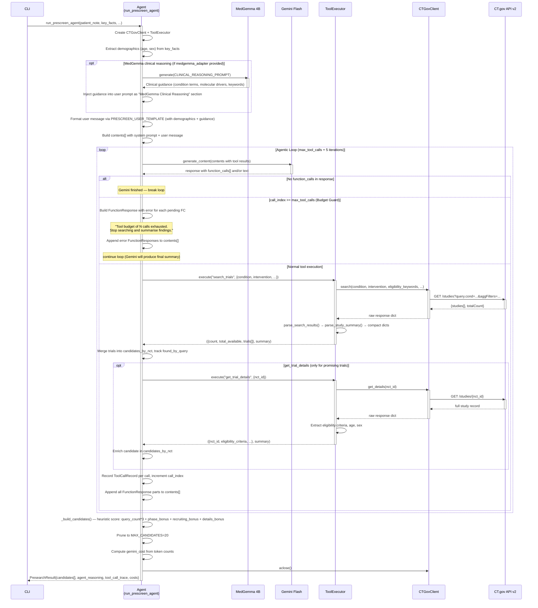
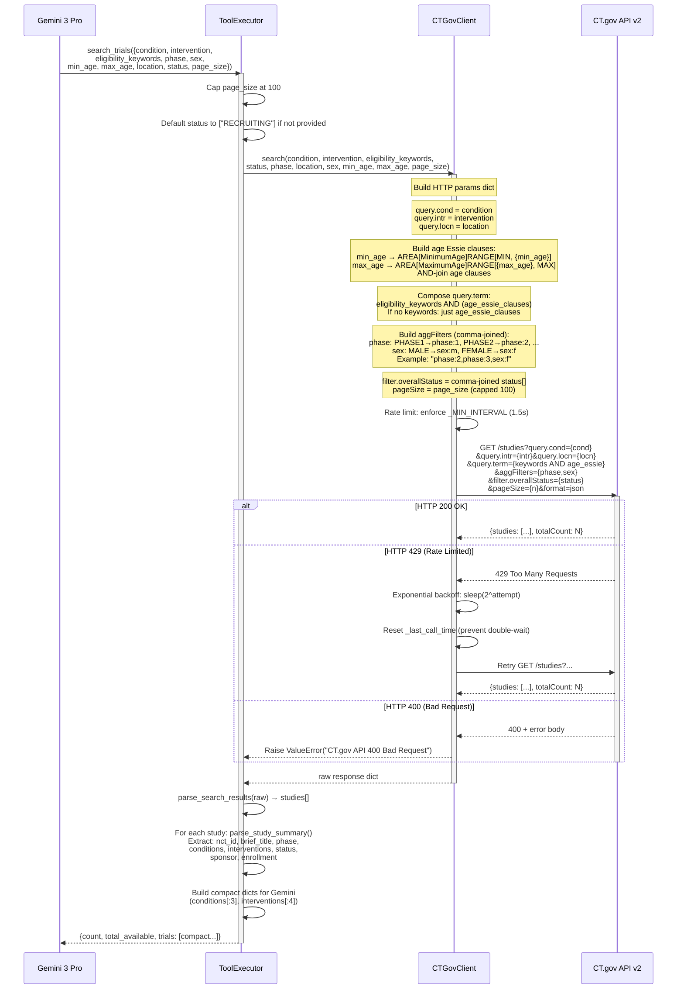
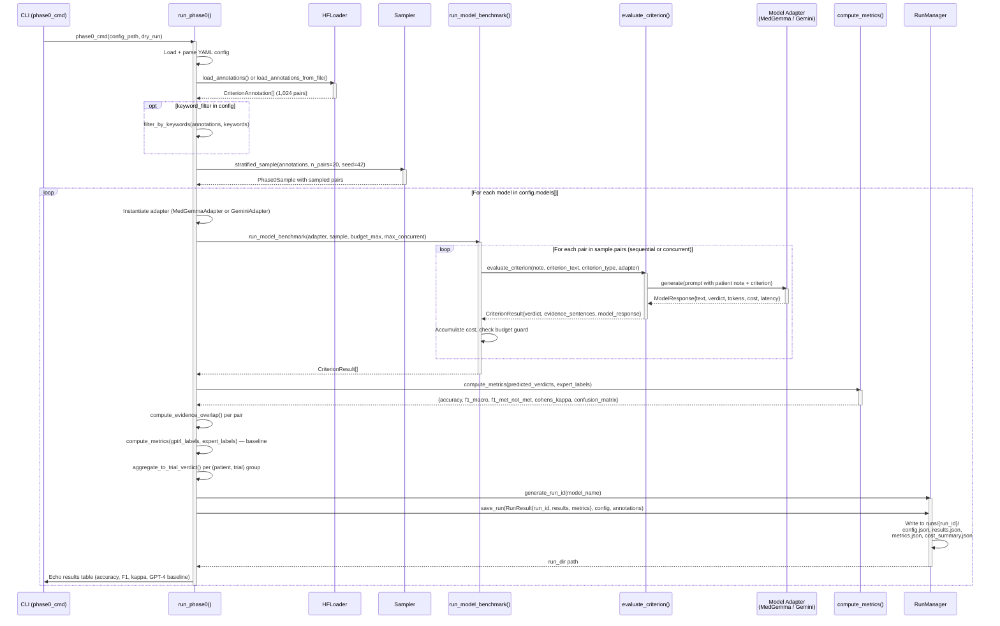
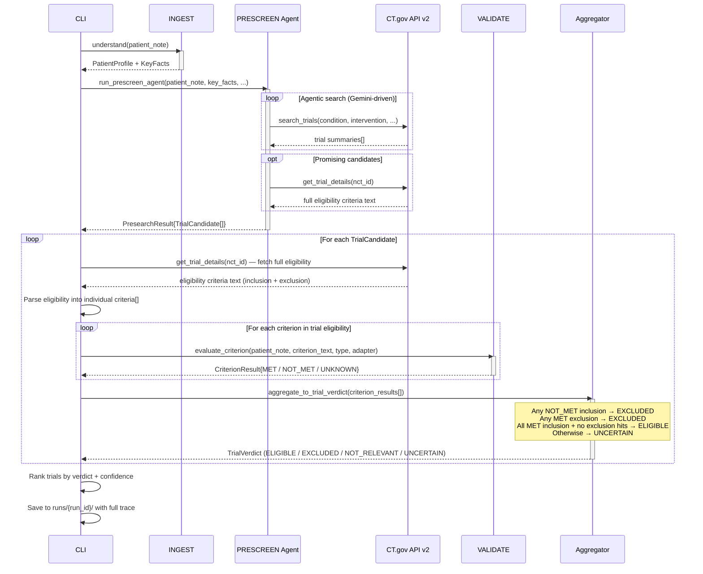

# Sequence Diagrams: PRESCREEN & Pipeline Interactions

> Generated from source: `src/trialmatch/prescreen/agent.py`, `tools.py`, `ctgov_client.py`, `cli/phase0.py`
>
> **Updated 2026-02-22**: Reflects current implementation — MedGemma clinical reasoning
> pre-search step (ADR-009), two tools only (normalize_medical_terms commented out — ADR-011),
> AREA[StudyType] filtering (ADR-010), heuristic candidate scoring.

---

## 1. PRESCREEN Agent Loop

The PRESCREEN pipeline has two phases:
1. **MedGemma clinical reasoning** (optional): MedGemma 4B generates clinical
   guidance (condition terms, molecular drivers, eligibility keywords) that is
   injected into Gemini's prompt.
2. **Gemini agentic loop**: Gemini autonomously searches ClinicalTrials.gov
   using two tools: `search_trials` and `get_trial_details`. The loop runs
   up to `max_tool_calls + 5` iterations, with a budget guard that sends
   structured FunctionResponse errors when the tool call cap is reached.

Note: `normalize_medical_terms` was the original third tool but was commented
out (ADR-011) due to ~25s latency with near-zero value.

---

## 2. CT.gov Parameter Mapping (Single search_trials Call)

Shows how Gemini's high-level search parameters are mapped to
ClinicalTrials.gov API v2 HTTP query parameters. Key details:
- `phase` and `sex` are joined into `aggFilters` (comma-separated)
- `min_age`/`max_age` become Essie `AREA[]RANGE[]` expressions in `query.term`
- `study_type` becomes `AREA[StudyType]Interventional` in `query.term` (ADR-010)
- `eligibility_keywords`, age, and study_type AREA clauses are AND-composed in `query.term`
- `filter.studyType` is NOT a valid API parameter — must use AREA syntax

---

## 3. Phase 0 Benchmark

The benchmark harness that evaluates criterion-level matching.
Loads TrialGPT HF annotations, samples pairs, runs each model,
computes metrics, and persists run artifacts.

---

## 4. Future E2E Pipeline

The planned end-to-end flow connecting all three components:
INGEST extracts the patient profile, PRESCREEN finds candidate trials,
and VALIDATE evaluates each eligibility criterion. Error propagation
is tested here (unlike isolated component evaluation which uses gold SoT inputs).

---

## Appendix: Key Data Structures

| Structure | Source | Purpose |
|-----------|--------|---------|
| `PresearchResult` | `prescreen/schema.py` | Agent output: candidates + trace + cost |
| `TrialCandidate` | `prescreen/schema.py` | Single trial from CT.gov with ranking metadata |
| `ToolCallRecord` | `prescreen/schema.py` | Trace record for each tool invocation |
| `CriterionResult` | `validate/evaluator.py` | Single criterion evaluation verdict + evidence |
| `TrialVerdict` | `evaluation/metrics.py` | Aggregated trial-level eligibility decision |
| `RunResult` | `models/schema.py` | Complete benchmark run for persistence |
